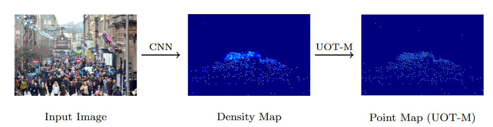

# Unbalanced Optimal Transport Maximization

# UOT-M



UOT-M algorithm is presented in the `uot_m.py`. The demo is shown in `demo.ipynb`:
```python
from uot_m import den2seq
den2seq(denmap, scale_factor=8, max_itern=16, ot_scaling=0.75)
```
- `denmap` is the density map with the shape of [H, W];
- `scale_factor` means the resolution ratio of image and density map (here it is 8 since the density map is 1/8 of input image);
- `max_itern` means the maximum number of UOT and M step;
- `ot_scaling` controls the step number of Sinkhorn algorithm, it is a value in (0, 1). `ot_scaling`$\rightarrow 1$ results in more iterations in UOT step.
